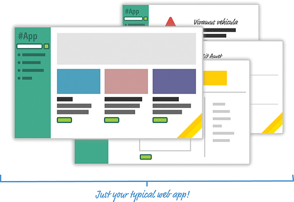
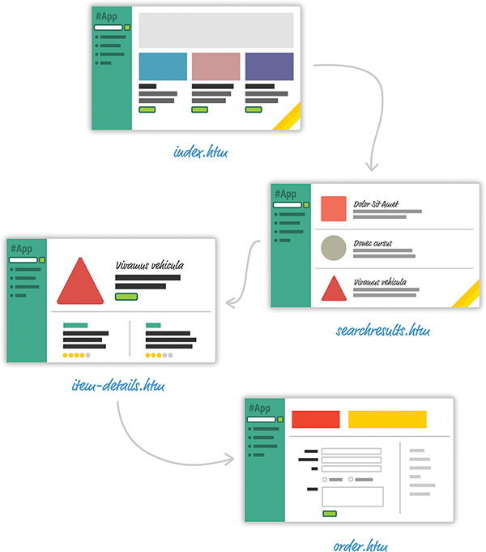
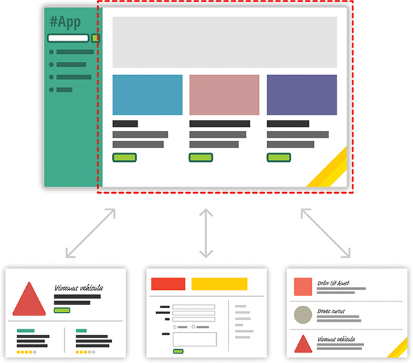
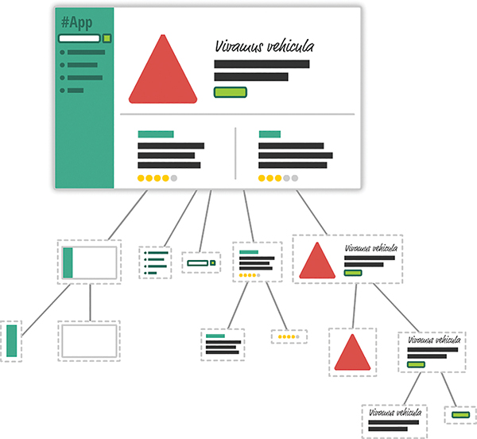

Consider a browser catalog webpage which consists of a search result page, a details page, and so on. 

Such an app can be built using one of the following ways: 
Old school multipage : 

Single page web applications :
You never navigate to different pages or even reload a different page. As users interact with our app, 
we replace the contents of the dotted red region with the data and HTML that matches what the user is 
trying to do. The end result is a much more fluid experience. Ex., facebook, gmail, twitter, etc

Challenges : 
 1) In a single-page application, you’ll spend the bulk of your time keeping your data in sync with your UI.
When navigating between pages in the old model, we assumed everything in our UI would be destroyed and just 
built back up again. This was never a problem.

 2) Manipulating the DOM is really, really slow.
Performing other DOM operations is one of the slowest things you can do in your browser. Unfortunately, in a 
single-page app, you’ll be doing a lot of this. Manipulating the DOM is the primary way you are able to react 
to user actions and display new content.

3) Working with HTML templates can be a pain

Facebook released a library called React which brings following factors to the table
i) Automatic UI state management

ii) Lightning-Fast DOM Manipulation
Because DOM manipulation is slow, you never modify the DOM using React. Instead, you modify in memory virtual 
DOM. It does so by comparing the changes between your virtual DOM and the real DOM, figuring out which changes 
actually matter, and making the fewest number of DOM changes needed to keep everything up-to-date in a process 
called reconciliation.

iii) APIs to Create Truly Composable UIs

iv) Visuals Defined Entirely in JavaScript

Besides having a really weird syntax, HTML templates have traditionally suffered from another major problem: 
You are limited in the variety of things you can do inside them, which goes beyond simply displaying data. If 
you want to choose a piece of UI to display based on a particular condition, for example, you have to write 
JavaScript somewhere else in your app or use some weird framework-specific templating command to make it work.

React does something pretty neat. By having your UI defined entirely in JavaScript, you get to use all the rich 
functionality JavaScript provides for doing all sorts of things inside your templates. You are limited only by 
what JavaScript supports, not limitations imposed by your templating framework.

Now, when you think of visuals defined entirely in JavaScript, you’re probably thinking something horrible that 
involves quotation marks, escape characters, and a whole lot of createElement calls. Don’t worry. React allows you 
to (optionally) specify your visuals using an HTML-like syntax known as JSX that lives fully alongside your 
JavaScript. Instead of writing code to define your UI, you are basically specifying markup:

v) Just the V in an MVC Architecture

We’re almost done here! React is not a full-fledged framework that has an opinion on how everything in your app 
should behave. Instead, React works primarily in the View layer, where all of its worries and concerns revolve 
around keeping your visual elements up-to-date