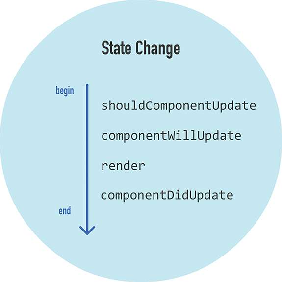
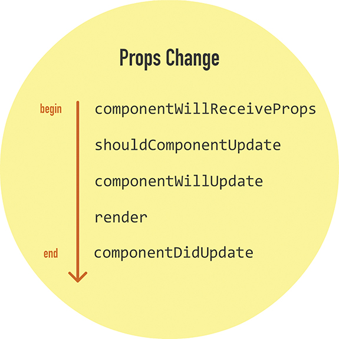

nsurprisingly, lifecycle methods are special methods that automatically get called as our component 
goes about its business. They notify us of important milestones in a component’s life, and we can use 
these notifications to simply pay attention or change what our component is about to do.

class CounterParent extends React.Component {
  constructor(props) {
   ....
  }
 
   componentWillUpdate(newProps, newState) {
    console.log("componentWillUpdate: Component is about to update!");
  }
 
  componentDidUpdate(currentProps, currentState) {
    console.log("componentDidUpdate: Component just updated!");
  }
 
  componentWillMount() {
    console.log("componentWillMount: Component is about to mount!");
  }
 
  componentDidMount() {
    console.log("componentDidMount: Component just mounted!");
  }
 
  componentWillUnmount() {
    console.log("componentWillUnmount: Component is about to be removed from the DOM!");
  }
 
  shouldComponentUpdate(newProps, newState) {
    .....
  }
 
  componentWillReceiveProps(newProps) {
    console.log("componentWillReceiveProps: Component will get new props!");
  }
 
  render() {
  ....
}
};

I) The initial rendering phase:

Getting the default props: to set a name property on our CounterParent component, it could look as follows:

CounterParent.defaultProps = {
  name: "Iron Man"
};
This gets run before your component is even created or any props from parent components are passed in.

Getting the Default State
This step happens inside your component’s constructor. You get the chance to specify the default value of this.state
as part of your component’s creation:

constructor(props) {
  super(props);
 
  console.log("constructor: Default state time!");
 
  this.state = {
    count: 0
  };
 
  this.increase = this.increase.bind(this);
}
Notice that we’re defining our state object and initializing it with a count property whose value is 0.

componentWillMount
This is the last method that gets called before your component gets rendered to the DOM. There’s an important 
point to note here: If you call setState inside this method, your component will not re-render.

render
This one should be very familiar to you by now. Every component must have this method defined, and it is 
responsible for returning some JSX. If you don’t want to render anything, simply return null or false.

componentDidMount
This method gets called immediately after your component renders and gets placed on the DOM. At this point, 
you can safely perform any DOM querying operations without worrying about whether your component has made it. 
If you have any code that depends on your component being ready, you can specify all of that code here as well.

With the exception of the render method, all of these lifecycle methods can fire only once. That’s quite 
different from the methods you see next.
-----------------------------------------------------------------------------------------------

II) Updating phase 

shouldComponentUpdate
Sometimes you don’t want your component to update when a state change occurs. This method allows you to control 
this updating behavior. If you use this method and return a true value, the component will update. If this method 
returns a false value, this component will skip updating.
shouldComponentUpdate(newProps, newState) { .. }

componentWillUpdate
This method gets called just before your component is about to update. Nothing too exciting happens here. One 
point to note is that you can’t change your state by calling this.setState from this method.

render
If you didn’t override the update via shouldComponentUpdate, the code inside render gets called again to ensure 
that your component displays itself properly.

componentDidUpdate
This method gets called after your component updates and the render method has been called. If you need to execute 
any code after the update takes place, this is the place to stash it.

---------------------------------------------------------------------------------------------------

Dealing with property 

The only new method here is componentWillReceiveProps. This method receives one argument, and this argument 
contains the new prop value that is about to be assigned to it.

--------------------------------------------------------------------------------------------------

The unmounting phase

Only one lifecycle method is active here, and that is componentWillUnmount. You perform cleanup-related tasks here, 
such as removing event listeners and stopping timers. After this method gets called, your component is removed 
from the DOM and you can say goodbye to it.