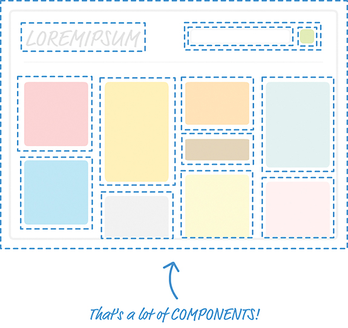

Every part of the app's visuals would be wrapped inside a self contained module known as component. 

Each dotted line represents an individual component that is responsible for both what you see and 
any interactions that it is responsible for. Don’t let this scare you. While this looks really 
complicated, you will soon see that it will start to make a whole lot of sense once you’ve had a chance 
to play with components and some of the awesome things they do—or, at least, try really hard to do.

React component are equivalent to reusable functions. They are reusable chunks of Javascript that 
output HTML elements.

Blank react document:
<!DOCTYPE html>
<html>
 
<head>
  <meta charset="utf-8">
  <title>React Components</title>
  
  
  
</head>
 
<body>
  

  
</body>
 
</html>

Using component to print a name :
Let’s re-create all of this by using a component. React gives us several ways of creating components, 
but we are going to create them by using the class syntax. Go ahead and add the following highlighted code 
just above the existing render method:

class HelloWorld extends React.Component {
 render() {
     return 
Hello, componentized world!

 }
}
 
ReactDOM.render(
  <HelloWorld/>,
  document.querySelector("#container")
);

Think of a HelloWorld component as a cool and new HTML tag whose functionality you have fully control on. 
You can do all the sorts of HTMLy things. You can go ahead and do following:
ReactDOM.render(
  

    <HelloWorld/>
  
,
  document.querySelector("#container")
);

Similar to adding arguments to function, you can add properties to react component:

I] Update the component definition
class HelloWorld extends React.Component {
  render() {
    return 
Hello, {this.props.greetTarget}!

  }
}

You access a property by referencing it via the this.props property that every component has access to. 
Notice how you specify this property: You place it inside curly brackets, { and }. In JSX, if you want something 
to get evaluated as an expression, you need to wrap that something inside curly brackets. If you don’t do that, 
you’ll see the raw text this.props.greetTarget printed out.

II] Modify the component call 
After you’ve updated the component definition, all that remains is to pass in the property value as part of the 
component call. This is done by adding an attribute with the same name as the property, followed by the value you 
want to pass in. In our example, that involves modifying the HelloWorld call with the greetTarget attribute and 
the value you want to give it.

ReactDOM.render(
  

    <HelloWorld greetTarget="Batman"/>
    <HelloWorld greetTarget="Iron Man"/>
    <HelloWorld greetTarget="Nicolas Cage"/>
    <HelloWorld greetTarget="Mega Man"/>
    <HelloWorld greetTarget="Bono"/>
    <HelloWorld greetTarget="Catwoman"/>
  
,
  document.querySelector("#container")
);

Each HelloWorld call now has the greetTarget attribute, along with the name of a superhero (or equivalent mythical 
being) that we want to greet. If you preview this example in the browser, you’ll see the greetings happily printed 
out onscreen.

Dealing with children

<CleverComponent foo="bar">
  
Something!

</CleverComponent>

Here you have a component very cleverly called CleverComponent, and it has a p element as a child. From within 
CleverComponent, you have the capability to access the p child element (and any children it has) via the children 
property accessed by this.props.children.

