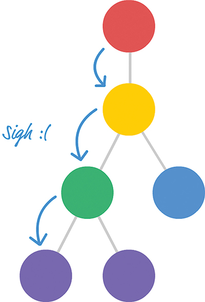
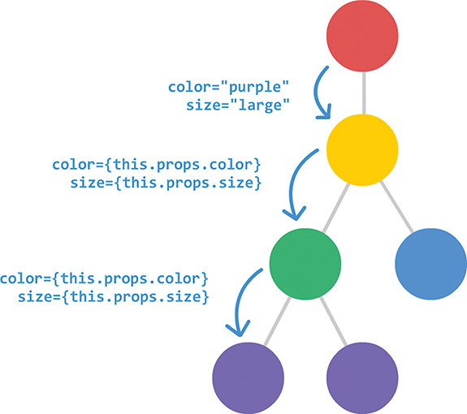

You can’t pass a property directly to the component or components that you want to target. The 
reason has to do with how React works. React enforces a chain of command in which properties 
have to flow down from a parent component to an immediate child component. This means you can’t 
skip a layer of children when sending a property. This also means your children can’t send a 
property back up to a parent. All communication is one-way from the parent to the child.

Every component that lies on the intended path has to receive the property from its parent and 
then resend that property to its child. This process repeats until your property reaches its intended 
destination. The problem is in this receiving and resending step.
Sending one property:

Sending multiple properties :

You can see that this approach is neither scalable nor maintainable. For every additional property 
we need to communicate, we have to add an entry for it as part of declaring each component. If we decide 
to rename our properties at some point, we have to ensure that every instance of that property is 
renamed as well. If we remove a property, we need to remove the property from being used across every 
component that relied on it. Overall, these are the kinds of situations we try to avoid when writing code. 
What can we do about this?

Meet the spread operator : 
printStuff(items[0], items[1], items[2]);
We access each array item individually and pass it in to our printStuff function. With the spread operator, 
we now have an easier way. You don’t have to specify each item in the array individually; you can just do 
something like this:
printStuff(...items);
The spread operator is the ... characters before our items array. Using ...items is identical to calling 
items[0], items[1], and items[2] individually, as we did earlier. The printStuff function will run and print 
the numbers 1, 2, and 3 to our console. 

The spread operator allows you to unwrap an array into its individual elements. The spread operator does a 
few more things as well, but that’s not important for now. We’re going to use only this particular side of 
the spread operator to solve our property transfer problem. As it turns out, there is a way. 

It actually involves the spread operator as well. We explain how later, but this means that we can call 
our Display component by using ...this.props:

<Display {...this.props} />
The runtime behavior when using ...this.props is the same as when specifying the color, num, and size 
properties manually. This means our earlier example can be simplified as follows (pay attention to the highlighted 
lines):

Is this the best way to transfer properties?

Using the spread operator to transfer properties is convenient, and it’s a marked improvement over explicitly 
defining each property at each component as we were originally doing. The thing is, even the spread operator 
approach isn’t a perfect solution. If all you want to do is transfer a property to a particular component, having 
each intermediate component play a role in passing it on is unnecessary. Worse, it has the potential to be a 
performance bottleneck. Any change to a property that you are passing along will trigger a component update on 
each component along the property’s path. That’s not a good thing! Later, we look at ways to solve this transferring 
properties problem in a much better, without any side effects.